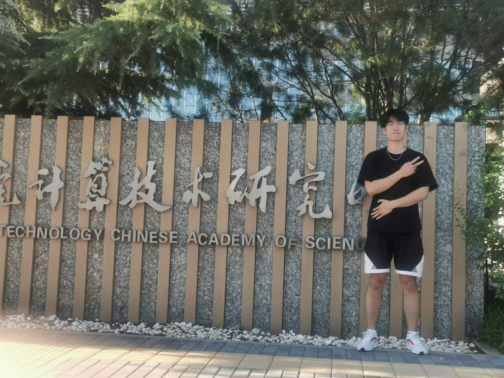








Hi there! I'm a PhD candidate of [AI Engine lab](https://www.ai-engine-lab.com/) at Renmin University of China, supervised by Prof. [Xu Chen](https://gsai.ruc.edu.cn/chenxu).I'm also a Research Assistant of IRlab Shandong University with the advisor of Prof. [Pengjie Ren](https://pengjieren.github.io/). I also work closely with Prof. [Zhaochun Ren](https://renzhaochun.github.io/), Prof. [Mengqi Zhang](https://zm7.github.io/) and Prof. [Xin Xin](https://xinxin-me.github.io/).
My research interest is mainly Recommender System , LLM agent and AI4SS. 

Email address: liyuanzi at mail.sdu.edu.cn

Please feel free to contact me if you have any questions.

# 📝 Papers

<!-- 
 -->

[1] **[Uncovering Selective State Space Model's Capabilities in Lifelong Sequential Recommendation
](https://arxiv.org/pdf/2403.16371) - CORR 2024**  
*Jiyuan Yang, **Yuanzi Li**, Jingyu Zhao, Hanbing Wang, Muyang Ma, Jun Ma, Zhaochun Ren, Mengqi Zhang, Xin Xin, Zhumin Chen, Pengjie Ren*

<!-- # 🎖 Honors and Awards -->

# 📖 Educations

- *2025.09 - 2030.06（expected）*, PhD, Renmin University of China, Beijing. (Supervised by Prof. Xu Chen)
- *2021.09 - 2025.06*, Bachelor, Shandong University, Qingdao.

# 💻 Internships

- *2022.10 - 2025.06*, Research Assistant, Information Retrieval Lab, Shandong University.

# 💬 Others
If you're interested in my roommate, please contact WeChat at zjy18354399989.

